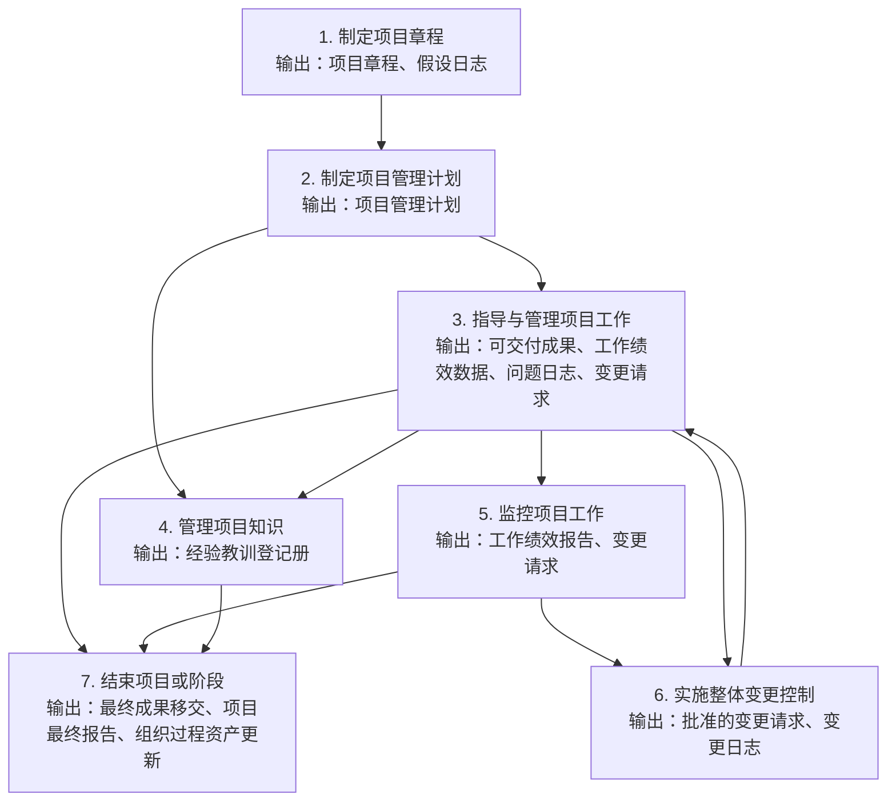

# 整合管理七过程输入输出流转图

这份文档不再按“一个过程一堆名词”去背，而是把第08章七个过程之间最值得记的输入输出流转链拉出来。

如果你已经开始发现“上一个过程的输出，会成为下一个过程的输入”，那说明你已经在用更接近考试和实际项目的方式理解整合管理了。

## 一、先看总闭环

## 二、这张图最该怎么理解

### 1. 章程把项目立起来，计划把项目管起来

- `制定项目章程` 输出 `项目章程`
- `制定项目管理计划` 把 `项目章程` 当重要输入

这是最前面的启动关系：

- 先解决“项目能不能正式开始”
- 再解决“项目后面具体怎么管”

一句话记忆：
`先有章程授权，再有总计划落地。`

### 2. 执行过程最像“现场主入口”

`指导与管理项目工作` 很重要，因为它一边消耗计划，一边产出很多后续过程都要吃的东西：

- `可交付成果`
- `工作绩效数据`
- `问题日志`
- `变更请求`

也就是说，很多后面的过程，并不是凭空开始的，而是从执行现场长出来的。

一句话记忆：
`执行过程既产成果，也产信号。`

### 3. 监控不是独立做题，它是接住执行现场的数据

- `指导与管理项目工作` 先产出 `工作绩效数据`
- `监控项目工作` 再基于这些数据和项目管理计划做分析
- 最终形成 `工作绩效报告`

这是一个典型流转：

`工作绩效数据 -> 分析判断 -> 工作绩效报告`

一句话记忆：
`数据来自现场，报告来自分析。`

### 4. 变更控制不是凭空冒出来的，它常常接住监控和执行发现的问题

`实施整体变更控制` 的关键输入里，最值得记的是：

- `变更请求`
- `工作绩效报告`

也就是说：

- 执行中发现问题，可能提出 `变更请求`
- 监控中发现偏差，可能也提出 `变更请求`
- 这些请求再进入 `实施整体变更控制` 统一评审

一句话记忆：
`变更控制接住现场问题和监控结论。`

### 5. 批准的变更请求会回流到执行

这是整合管理最有代表性的闭环之一：

1. `监控项目工作` 或 `指导与管理项目工作` 发现问题
2. 形成 `变更请求`
3. `实施整体变更控制` 审批
4. 形成 `批准的变更请求`
5. 再回到 `指导与管理项目工作` 落地执行

所以你之前发现得特别对：

`变更请求 -> 批准的变更请求 -> 回到执行`

这条链本质上就是：

`发现偏差 -> 正式提改 -> 批准 -> 落地`

一句话记忆：
`变更控制负责批，指导与管理项目工作负责干。`

### 6. 管理项目知识是一条“边做边沉淀”的支线

`管理项目知识` 不只是收尾时回顾一下，而是项目进行中就持续发生。

它常常吃进：

- `项目管理计划`
- `项目文件`
- `可交付成果`

它产出：

- `经验教训登记册`

所以它像一条并行支线：

- 一边做项目
- 一边沉淀知识
- 最后再反哺组织过程资产和未来项目

一句话记忆：
`知识管理不是最后补作业，而是边做边留经验。`

### 7. 收尾会接住前面很多过程的结果

`结束项目或阶段` 不是只接一个输入，它常常是在整个闭环末端收口：

- 接可交付成果的正式验收结果
- 接项目管理计划和项目文件
- 接经验教训
- 接合同和组织过程资产要求

所以收尾更像：

- 把成果交出去
- 把项目状态关掉
- 把文档和经验留给组织

一句话记忆：
`收尾不是一个点，而是把前面的东西一起收口。`

## 三、最该背的 4 条流转链

如果你时间有限，至少先把下面 4 条背下来：

### 1. 授权到计划

`项目章程 -> 项目管理计划`

### 2. 执行到监控

`工作绩效数据 -> 监控分析 -> 工作绩效报告`

### 3. 监控到变更到执行

`变更请求 -> 批准的变更请求 -> 执行落地`

### 4. 执行到知识沉淀

`可交付成果 / 项目文件 / 实际问题 -> 经验教训登记册`

## 四、为什么这种学法更适合案例题

案例题很少只问你“某个过程定义是什么”，更常问的是：

- 问题是在哪个环节发现的
- 应该形成什么文件
- 这个文件后面应该进入哪个过程
- 为什么没有闭环

所以你如果只背过程名，答题会散；  
如果你能看见这些流转链，答题会明显更顺。

## 五、最后压缩记忆

整合管理七过程最值得记的，不只是 `章 -> 计 -> 指 -> 知 -> 监 -> 变 -> 收`，还要记这条流转主线：

`章程授权 -> 总计划 -> 执行产数据和问题 -> 监控出报告和请求 -> 变更审批 -> 批准后回到执行 -> 最后正式收尾`
