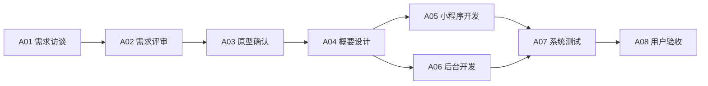

# 项目进度网络图说明（样例）

```mermaid
flowchart LR
  A["A01 需求访谈"] --> B["A02 需求评审"]
  B --> C["A03 原型确认"]
  C --> D["A04 概要设计"]
  D --> E["A05 小程序开发"]
  D --> F["A06 后台开发"]
  E --> G["A07 系统测试"]
  F --> G
  G --> H["A08 用户验收"]
```

## 说明

- A05 和 A06 可并行。
- 关键路径为 A01-A02-A03-A04-A05/A06-A07-A08。
